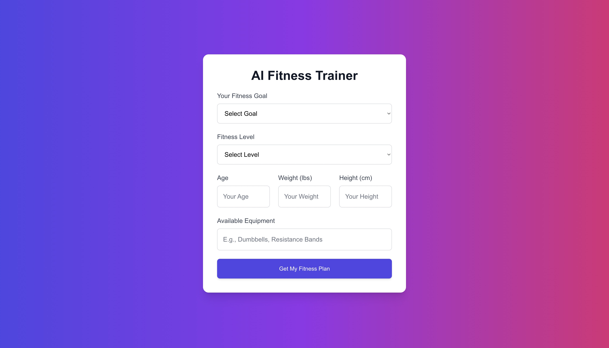
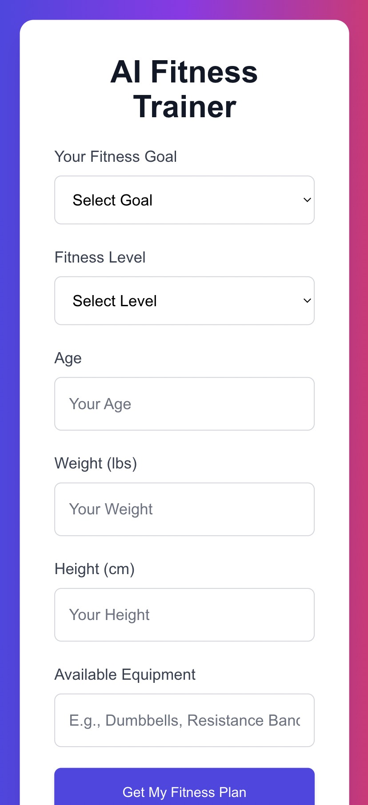

# AI Fitness Trainer

AI Fitness Trainer is a web application that uses AI to generate personalized fitness plans based on user input. Whether your goal is to **lose weight**, **build muscle**, or **improve endurance**, the app provides a custom fitness plan tailored to your fitness level, available equipment, and personal data such as age, weight, and height.

This project is built using **Next.js 13**, **React**, and **Tailwind CSS** to provide a modern, responsive user interface, and it integrates with **OpenAI's GPT-4** API to generate fitness plans.

## Features

- **Personalized Fitness Plans**: Users can input their fitness goals, fitness level, available equipment, and personal data to receive a customized fitness plan.
- **AI-Powered**: Powered by **OpenAI GPT-4** to generate realistic and effective fitness plans.
- **Responsive Design**: Fully responsive UI optimized for desktop, tablet, and mobile devices.
- **Modern Styling**: Built with **Tailwind CSS** for a clean and modern design.
- **Clipboard Copy**: Users can copy the generated plan to their clipboard for easy access.
- **Error Handling**: Proper handling of missing inputs and API errors.

## Tech Stack

- **Frontend**: 
  - **Next.js 13** (App Directory, React)
  - **Tailwind CSS** (for modern and responsive UI)
- **Backend**:
  - **OpenAI GPT-4** (for generating personalized fitness plans)
  - **API routes** (for handling user requests and interaction with OpenAI)

## Demo

Check out the live demo here: [AI Fitness Trainer](https://ai-fitness-trainer-plum.vercel.app/)

## Installation

To run the project locally, follow these steps:

### Prerequisites

- Node.js (v14 or later)
- npm (v6 or later)

### Steps

1. **Clone the Repository**

   ```bash
   git clone https://github.com/Sudhanshu9999/ai-fitness-trainer.git
   ```

2. **Navigate into the Project Folder**

   ```bash
   cd ai-fitness-trainer
   ```

3. **Install Dependencies**

   ```bash
   npm install
   ```

4. **Set up Environment Variables**

   Create a `.env.local` file in the root of the project and add your **OpenAI API key**:

   ```
   OPENAI_API_KEY=your-openai-api-key-here
   ```

   You can get your OpenAI API key from the [OpenAI API Key](https://platform.openai.com/account/api-keys) page.

5. **Run the Development Server**

   ```bash
   npm run dev
   ```

6. Open your browser and go to [http://localhost:3000](http://localhost:3000) to view the app.

## How It Works

1. **User Input**: The app allows users to input their fitness goal, fitness level, available equipment, age, weight, and height.
2. **API Call**: Upon submission, the app sends a **POST** request to an API route in the Next.js backend.
3. **AI Response**: The backend calls the **OpenAI GPT-4 API** with the user's data, and the model generates a personalized fitness plan.
4. **Display Plan**: The plan is displayed to the user in a clear format, with the option to copy it to the clipboard.

## Screenshots

### Desktop View


### Mobile View


## Features to Add

- **User Authentication**: Allow users to save their plans and track progress over time.
- **Advanced Customization**: Add more customization options like specific workout types, meal suggestions, etc.
- **Progress Tracker**: Integrate a way for users to track their progress on fitness plans.

## Contributing

We welcome contributions to improve the project!

1. Fork the repository.
2. Create a new branch (`git checkout -b feature-name`).
3. Make your changes and commit them (`git commit -am 'Add new feature'`).
4. Push to the branch (`git push origin feature-name`).
5. Create a new Pull Request.

## License

This project is not currently licensed. Feel free to use it at your own discretion.
